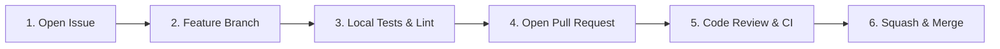

# Contributing to IntelAI

Thank you for your interest in contributing to **IntelAI**! We welcome contributions from developers, researchers, and engineers.

This document provides guidelines for contributing code, reporting issues, submitting feature requests, and understanding our dual-licensing architecture.

---

## 📜 Table of Contents

1. [Code of Conduct](#code-of-conduct)
2. [Licensing & Commercial Boundary](#licensing--commercial-boundary)
3. [Developer Certificate of Origin (DCO)](#developer-certificate-of-origin-dco)
4. [Contribution Workflow](#contribution-workflow)
5. [Local Development & Setup](#local-development--setup)
6. [Testing Standards](#testing-standards)
7. [Commit Message Standards](#commit-message-standards)
8. [Security & Vulnerability Disclosure](#security--vulnerability-disclosure)

---

## 🤝 Code of Conduct

We are committed to providing a welcoming, inclusive, and harassment-free experience for everyone. Please maintain professional, respectful, and constructive communication across all issues, pull requests, and discussions.

---

## ⚖️ Licensing & Commercial Boundary

IntelAI is distributed as open-source software under the **GNU Affero General Public License v3.0 (AGPL-3.0)**.

- **Open Source Contributions**: By submitting a pull request, you agree that your contribution is licensed under the AGPL-3.0.
- **Commercial & Enterprise Licensing**: If your organization requires closed-source deployment, proprietary SaaS integration, or distribution without AGPL-3.0 copyleft obligations, commercial licensing is available via **OmniIntelOS**. Please consult [`COMMERCIAL.md`](./COMMERCIAL.md) or contact `siddoyacinetech227@gmail.com` for details.

---

## ✍️ Developer Certificate of Origin (DCO)

To ensure clear intellectual property provenance, IntelAI requires contributors to sign off on commits certifying adherence to the Developer Certificate of Origin (DCO 1.1).

Add a sign-off line to each git commit using the `-s` / `--signoff` flag:

```bash
git commit -s -m "feat(rag): add hybrid dense-sparse vector scoring reranker"
```

This appends the following metadata to your commit message:
```text
Signed-off-by: Your Full Name <your.email@example.com>
```

---

## 🔄 Contribution Workflow

We strictly follow the standard GitHub collaboration lifecycle:



1. **Issue First**: Open an issue describing the bug, enhancement, or architectural proposal before writing code.
2. **Branching**: Create a focused branch from `master`:
   ```bash
   git checkout -b feat/your-feature-name
   # or
   git checkout -b fix/issue-description
   ```
3. **Develop & Test**: Implement your changes and ensure all tests pass locally.
4. **Pull Request**: Open a PR targeting `master`. Reference the related issue (e.g., `Fixes #123`).
5. **Review**: Ensure automated CI checks pass and address reviewer feedback.

---

## 🛠️ Local Development & Setup

### Prerequisites
- Python 3.11+
- Node.js 20+ (for Next.js / React UI components)
- PostgreSQL with `pgvector` (optional for local mocked tests)
- Qdrant Vector DB (optional for local mocked tests)

### Environment Setup
```bash
# 1. Clone repository
git clone https://github.com/Yacine-ai-tech/IntelAI.git
cd IntelAI

# 2. Set up Python virtual environment
python3 -m venv venv
source venv/bin/activate

# 3. Install dependencies in editable mode
pip install -e .
pip install -r requirements.txt

# 4. Copy environment example
cp .env.example .env
```

> **Note**: Real API keys are never required to run offline unit tests. `.env.example` provides mock placeholders.

---

## 🧪 Testing Standards

All code changes must pass the test suite before submitting a PR. We separate tests into offline unit tests and live integration tests.

### Running Unit Tests (No External Services Required)
```bash
pytest tests/ -m "unit" -v
# or run the full offline suite:
pytest tests/ -v
```

### Key Testing Rules
- Unit tests must be fast, deterministic, and fully mocked (zero external network dependencies).
- New API endpoints must include route validation, status code, and payload tests.
- Maintain or increase code coverage with every non-trivial change.

---

## 📝 Commit Message Standards

We enforce [Conventional Commits (v1.0.0)](https://www.conventionalcommits.org/):

| Type | Description |
| :--- | :--- |
| `feat:` | A new user-facing feature |
| `fix:` | A bug fix |
| `docs:` | Documentation changes only |
| `test:` | Adding or correcting test cases |
| `refactor:` | Code change that neither fixes a bug nor adds a feature |
| `perf:` | A code change that improves performance |
| `chore:` | Maintenance tasks, dependency updates, CI workflows |

**Example**:
```text
feat(retrieval): implement dynamic Reciprocal Rank Fusion for Qdrant and BM25

Signed-off-by: Developer Name <developer@example.com>
```

---

## 🔒 Security & Vulnerability Disclosure

If you discover a potential security vulnerability, please **do NOT open a public GitHub issue**. Instead, report it privately via email:

- **Security Contact**: `siddoyacinetech227@gmail.com`
- **Response SLA**: Initial triage within 48 business hours.

Thank you for helping keep IntelAI safe and reliable for the community!
